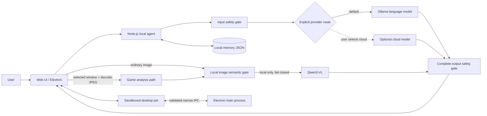

# Amadeus Local Companion

> A privacy-first, local-first multimodal AI companion built with Node.js, Electron, and Ollama.
> 一个强调隐私边界、本地推理与安全工程的多模态 AI 桌面伴侣原型。

<p align="center">
  
</p>

这是一个受《STEINS;GATE》角色牧濑红莉栖启发的非官方工程作品集项目。它不只是给模型套一层聊天界面，而是把本地模型编排、可选云端能力、桌面端安全边界、游戏画面分析、输入/输出安全门和素材合规流程组合成一个可运行的产品原型。

> [!IMPORTANT]
> 本项目用于非商业技术展示，与 MAGES.、NITRO PLUS 或《STEINS;GATE》官方无关。角色名称与形象相关权利归各自权利人所有；若用于商业发布，应替换为原创角色、名称和素材。

## 项目概览

| 维度 | 实现 |
| --- | --- |
| 产品形态 | Web 主界面 + Windows Electron 透明桌宠 |
| AI 路由 | 默认使用本机 Ollama；云端生成只能由用户显式选择 |
| 多模态 | 文字、静态图片、按需语音识别、游戏窗口离散截帧 |
| 本地模型 | Qwen2.5 / Qwen3 / DeepSeek R1 / Qwen3-VL，可在模型中心切换与下载 |
| 隐私设计 | 仅监听本机回环接口；Ollama 只接受字面量回环地址；游戏截图禁止远传且不落盘 |
| 安全设计 | 文本双向检查、本地图像语义门、凭据脱敏、危机支持、严格媒体解析和限流 |
| 桌面安全 | renderer sandbox、context isolation、禁用 Node.js、窄 IPC、来源校验、导航阻断 |
| 工程验证 | 189 个 Node 自动化测试 + 浏览器实测 + 冒烟测试 + Python 语料/素材验证 + 安装包内容/Fuse 审计 |

## 为什么值得作为面试作品展示

### 1. 本地优先是代码约束，不是宣传语

- 默认对话走本机 Ollama。
- 默认“仅本地”模式在 Ollama 不可用时会明确报错，不会伪装成演示状态，更不会偷偷把内容发到云端；只有手动选择“本地优先”或“演示模式”才会使用演示回复。
- 云端生成和 OpenAI Moderation 分别需要显式配置与开启。
- 游戏画面路径强制 `allowRemote: false`，即使普通聊天启用了远端复核也不会改变。
- `OLLAMA_URL` 只接受 `http://127.0.0.1` 或 `http://[::1]`，拒绝主机名、局域网地址、凭据、路径和查询参数，防止“本地模型”配置实际把内容发往其他机器。

### 2. 安全检查覆盖模型调用前后

- 用户输入在进入模型前分类、阻断或脱敏。
- 所有图片先经过同一台本机上的结构校验和独立语义安全判定；模型缺失、超时、输出不完整或结论不确定时失败即拒绝。
- 模型完整输出先在内存中缓冲，通过输出检查后才显示。
- 被判定为 `support` 或 `block` 的原文不写入历史。
- 对密码、令牌、手机号、邮箱等内容应用本地检测与脱敏。
- 普通对话不使用“你只要”“把条件说清楚”“先别”等命令或训斥式措辞；只有明确、迫近的现实安全风险，或用户主动要求操作步骤时，才给出必要且克制的直接指引。

这里刻意选择了“安全放行后一次性展示”，而不是先流式输出再补救。代价是牺牲部分首字可见速度，收益是避免不安全内容已经显示后才被拦截。

### 3. Electron 使用最小权限边界

- Web 主界面不依赖弹窗或画中画权限，桌宠固定渲染在页面内的 Shadow DOM 隔离浮层；Electron 仍使用独立透明原生窗口。
- Web 桌宠外层没有矩形背景，只保留局部状态/对话控件；空闲时在视口安全范围内缓慢漫游，用户文本、回复内容和头像点击等交互会驱动短暂情绪动作。
- 主界面和桌宠 renderer 均启用 sandbox 与 context isolation。
- 禁用 renderer 的 Node.js、任意导航、新窗口和通用文件/命令能力。
- host preload 只暴露 `togglePet`、`onPetVisibility` 和无路径参数的 `trashDesktopFile`；pet preload 只保留显示/关闭、返回主界面和边缘状态等既有窄接口。
- IPC 同时校验 sender、页面来源、参数类型和固定枚举。
- “移入回收站”的主进程 IPC 只能由 Electron host 调用；桌宠中的用户点击也只会向 host 发送固定的无路径意图。系统文件选择器只选一个普通文件，随后出现默认取消的二次确认，最终只调用 `shell.trashItem`。renderer 不提交也拿不到路径，模型不能触发；目录、符号链接和确认前发生变化的文件均拒绝，且没有永久删除回退。
- Electron 每次启动独立的本地服务子进程，并使用系统分配的临时端口。
- 打包版将只读应用资源、可写用户数据和外部模型目录分离；Forge 配置显式排除模型、音频、授权原文、隔离区、密钥和运行时状态。
- 漫游边界模块 `electron/pet-roam.cjs` 与回收站服务 `electron/file-trash-service.cjs` 已纳入严格运行时白名单、源哈希和包审计边界。

### 4. 游戏陪玩采用可解释的隐私模型

- 用户必须主动选择窗口；普通浏览器拒绝整屏/标签页，Electron 使用分页的原生窗口选择器；默认只在点击后分析一帧。
- 可选 30 / 60 / 120 秒低频观察，画面变化很小时跳过模型调用。
- 截图压缩到最长边 1280px，并受 2MB、300 万像素、单并发与频率限制。
- 画面先由本地语义安全门检查，再交给本地 `qwen3-vl:4b`；不保存到磁盘，也不读取或污染普通对话历史。
- 切换窗口取消时保留原共享；停止后会中止分析、卸载实际使用的视觉模型并通过 Ollama 运行列表确认释放结果。
- 不读取游戏内存、不控制键鼠、不提供隐藏信息或反作弊绕过。

### 5. 素材与训练数据有明确合规边界

- 仓库不包含原作完整台词、音频、模型权重或本地运行数据。
- 本地人物素材管线要求显式确认处理权利，并记录来源与文件哈希。
- 原始素材、隔离区、授权材料和生成语料默认被 `.gitignore` 排除。
- 静态桌宠素材经过格式、透明通道、尺寸、编号、路径和目录一致性校验。

## 系统架构



## 核心功能

| 模块 | 能力 | 关键实现点 |
| --- | --- | --- |
| 对话 Agent | 文本、图片、语音、多轮历史 | 本地/云端显式路由、停止生成、耗时与状态反馈 |
| 模型中心 | 探测、下载、切换 Ollama 模型 | 流式下载进度、运行状态、语言/视觉模型分离 |
| 长期记忆 | 本地保存偏好、事件和边界 | 保存和调用前均检查；作为非可信用户数据注入 |
| 语音 | faster-whisper tiny + 系统 TTS | 识别进程按需启动并退出；朗读由用户手动开启 |
| 游戏陪玩 | 手动/低频截图分析 | 仅窗口捕获、变化检测、降低剧透、独立历史、可验证显存释放 |
| 桌面宠物 | 透明置顶、受限漫游、情绪动作 | 88 个静态姿态、84 帧动画；Web 空闲时在视口内漫游，Electron 在工作区内随机移动并在手动拖动后暂停；文本、回复和交互驱动情绪 |
| 安全服务 | 本地策略 + 可选远端复核 | 文本双向检查、本地图像语义门、凭据脱敏、危机支持、失败关闭 |
| 素材管线 | 语料构建与桌宠资源验证 | 权利确认、来源记录、媒体真格式检查、原子目录同步 |

## 技术栈

- Runtime: Node.js 22.12+
- Desktop: Electron 43
- Frontend: Vanilla JavaScript, HTML, CSS
- Local AI: Ollama
- Optional cloud: explicit opt-in generation and moderation adapters
- Speech: faster-whisper tiny, Web Speech API
- Tooling: Python 3, PowerShell
- Testing: Node.js test runner, integration smoke tests, Python validation scripts

项目故意没有引入大型前端框架：界面状态、流式事件、媒体采集和桌宠协议都以浏览器原生 API 实现，便于直接审查数据流和安全边界。

## 快速开始

### 环境要求

- Node.js 22.12+
- Python 3（运行语料/素材验证时需要；使用本地语音识别还需安装 `faster-whisper`）
- [Ollama](https://ollama.com/)（使用本地模型时需要）
- Windows 10/11（Electron 桌宠当前主要验证平台）

### 1. 安装

克隆仓库后进入项目目录：

```powershell
npm ci
```

### 2. 准备本地模型

最小文字对话配置：

```powershell
ollama pull qwen2.5:3b
```

如需游戏画面分析：

```powershell
ollama pull qwen3-vl:4b
```

也可以启动应用后在“模型中心”中下载和切换模型。

Ollama 地址如需覆盖，只能使用字面量回环地址，例如 `OLLAMA_URL=http://127.0.0.1:11434`；不会接受 `localhost`、局域网或公网代理地址。

本地语音识别是可选组件。它会把 Python 解析为绝对路径并按需检查 `faster-whisper`；未就绪时模型中心会显示具体原因，不影响文字、图片或游戏功能。安装版不会捆绑或静默下载 Python。

```powershell
python -m pip install faster-whisper
python -c "from huggingface_hub import snapshot_download; snapshot_download('Systran/faster-whisper-tiny', local_dir=r'models\speech\faster-whisper-tiny')"
```

开发版从项目的 `models\speech\faster-whisper-tiny` 读取模型；安装版路径是 `%LOCALAPPDATA%\Amadeus Local Companion\models\speech\faster-whisper-tiny`，下载时请相应替换 `local_dir`。如自动发现不正确，可把 `AGENT_PYTHON_EXECUTABLE` 设置为可信 Python 可执行文件的绝对路径。

### 3. 可选：配置本地用户资料

仓库只提交空值模板；真实称呼、代词、兴趣、回复偏好和交流边界统一保存在被 Git 忽略的 `data/user-profile.local.json`：

```powershell
Copy-Item data/user-profile.example.json data/user-profile.local.json
```

把 `enabled` 改为 `true` 后再填写需要的字段。`preferredFormOfAddress` 表示希望角色如何称呼你；schema 不接受现实住址字段。该文件经过严格字段、长度和本地安全校验，只会作为低权限背景数据提供给本地普通聊天；云端模式和游戏陪玩不会读取它，浏览器页面与 Electron IPC 也拿不到原始内容。不要在其中保存邮箱、电话、证件号、账号或密钥；密钥仍应使用进程环境变量或系统凭据库。

如需把资料放到仓库之外，可在启动前设置 `AGENT_USER_PROFILE_PATH` 为本机文件路径。这个路径及文件内容都不应写进版本控制。

### 4. 启动 Web 版

```powershell
npm start
```

使用终端显示的本地访问地址打开页面。

### 5. 启动 Electron 桌宠

```powershell
npm run desktop
```

请从自己的 Windows PowerShell 运行。桌面启动脚本会拒绝受限自动化账户，但 Electron 自身仍保留 renderer sandbox、上下文隔离和 IPC 校验。

若要调查 Electron/GPU/renderer 原生崩溃，可显式开启纯本地诊断模式：

```powershell
npm run desktop:diagnose
```

诊断模式才会启用本地 Crashpad dump、脱敏后的 `events.jsonl` 和 Chromium 直接写入的 `chromium-raw.log`；不上传，并自动限制数量、大小和保留时间。JSONL 会过滤路径、邮箱和常见凭据赋值，但原始 Chromium 日志可能包含本机路径、URL 或控制台内容，dump 也可能包含进程内存片段；提交 issue 前必须由用户人工检查，不能直接公开整个诊断目录。

### 6. 制作 Windows 安装包

```powershell
npm run make:desktop
npm run audit:package
```

Forge/Squirrel 会在 `out/make/squirrel.windows/x64/` 生成 `Setup.exe`、`.nupkg` 和 `RELEASES`。构建前只接受与 npm 锁定 `checksums.json` 相符的 Electron 官方 ZIP，并使用固定 SHA-256 的 NuGet 6.11.1，避免 Squirrel 内置 NuGet 2.8 的大 ASAR 打包故障；这些缓存都在 `downloads/`，不会提交。构建后审计严格运行时白名单、全部应用源文件哈希、HTML/JS 依赖、私密文件边界和 Electron Fuses。`audit:package` 默认选择 `out/` 中最新的 Windows 应用目录，也可用 `npm run audit:package -- <目录>` 指定。

公开配置使用中性的发布者名称和固定 Electron 版本图标。若本地构建需要私有发布者标签或不可变图标 URL，把 `release.local.example.cjs` 复制成被 Git 忽略的 `release.local.cjs` 后填写；该文件不会进入应用包。

当前开发安装包未签名，只适合本机测试，不应作为正式下载发布。正式发布必须先配置由仓库外 secret 管理的 Windows 代码签名，再用两个已签名版本完成更新链验收；项目在此之前不会启用自动更新。

云端生成与远端安全复核均为显式启用的可选能力。仓库不提供、读取或提交任何真实凭据；游戏截图始终不会发送到远端。

## 验证

快速语法检查与单元测试不要求本地模型：

```powershell
npm run check
```

当前覆盖 189 个 Node 测试，重点验证：

- 安全判定、危机支持、凭据脱敏和远端复核策略
- 本地用户资料的严格 schema、脱敏以及云端/游戏隔离
- 图片/音频真实格式、尺寸、动画和路径校验
- 字面量回环 Ollama 边界、本地图像语义失败关闭和游戏会话隔离
- 左栏移除、运行状态徽章、人物风格检索、内部标签清理与严格情绪短回复准入
- Web Shadow DOM 桌宠的透明外层、受限漫游、文本/回复/交互情绪映射，以及素材 catalog、动画 URL 和边缘状态
- Electron 桌宠漫游边界与手动拖动暂停；host preload 最小接口及“选择单个普通文件—二次确认—系统回收站”的失败关闭策略
- Electron 启动账户策略、运行时路径分离、结构化诊断日志脱敏、包边界和 Fuse

完整集成验收会调用实际本地服务、语言模型和视觉模型，并验证可选语音组件“就绪或给出明确原因”的状态契约。先在一个终端运行 `npm start`，再在另一个终端执行：

```powershell
npm test
```

如果只修改素材或人物语料，可分别运行：

```powershell
npm run test:catalog
npm run test:pet
python scripts/test_character_corpus.py
```

## 目录结构

```text
.
├─ electron/                  # 主进程、preload、桌宠漫游与受限回收站服务
├─ lib/                       # 安全分类、安全服务、媒体校验
├─ public/                    # Web UI、桌宠逻辑与可发布素材
├─ data/                      # 默认风格词典、本地资料空值模板及数据说明
├─ scripts/                   # 启动、冒烟测试、语料与素材管线
├─ tests/                     # Node 自动化测试
├─ forge.config.cjs           # Windows 打包边界、Squirrel 与 Electron Fuses
├─ server.js                  # 本地 HTTP Agent 与模型编排
└─ docs/                      # 开发交接与许可核查
```

继续开发前请阅读 [`docs/DEVELOPMENT_HANDOFF.md`](docs/DEVELOPMENT_HANDOFF.md)。人物风格素材的使用边界见 [`docs/LEGAL_TEXT_SOURCES.md`](docs/LEGAL_TEXT_SOURCES.md)。

## 隐私与安全不变量

- 服务只绑定回环地址，不对局域网或公网监听。
- 本地模型不可用时不会自动把内容转交云端。
- Ollama 连接只允许字面量 HTTP 回环地址；图片语义门始终在本机执行并失败关闭。
- 游戏截图、游戏上下文和游戏分析永远禁止远程审核。
- 模型输出必须先完整通过安全检查，才会显示给用户。
- Electron renderer 不获得通用文件、shell、URL 或 IPC 权限；唯一文件动作是 host 的无路径 `trashDesktopFile`，路径只存在于主进程系统选择/确认对话框中，并且只能进入系统回收站。
- `.env`、本地用户资料、记忆、设置、模型、音频、授权原文和隔离区不会进入版本控制。
- 本地用户资料与长期记忆只进入本地普通聊天；云端模式和游戏陪玩不会读取它们。

Electron 安装版把模型、提取后的转写脚本、诊断文件以及 Chromium `sessionData` 放在 Windows Local AppData；聊天历史、TTS/游戏偏好等浏览器存储随 `sessionData` 留在本机。设置、资料、记忆和自定义语料位于 Electron 标准 `userData`（Windows 通常是 Roaming AppData）。从旧版升级后，旧 Roaming 会话缓存不会自动复制或删除；需要清除时请先退出应用，再由用户自行删除对应旧目录。应用本身不上传这些内容，但操作系统或企业备份策略可能处理 Roaming 数据，卸载应用也未必自动删除 Local/Roaming 残留。

## 已知限制

- Windows Squirrel 安装包、包内容审计和本地崩溃诊断已实现，但开发产物尚未代码签名；自动更新因此保持禁用。
- Electron 自动化检查已通过，仍需要在用户真实 GPU、多显示器、休眠唤醒环境做长时间稳定性测试；本地 dump 只为归因提供证据，不保证自动定位原生崩溃。
- Electron 的受限随机漫游与手动拖动暂停已有确定性测试，但多显示器/DPI 上的实际移动仍需用户桌面验收；安全文件清理也仍需在真实 GUI 中验证文件选择、默认取消确认和 Windows 回收站结果。
- 游戏陪玩仍属实验功能，效果受硬件、视觉模型和具体游戏画面影响。“降低剧透”是提示与会话隔离约束，不是对任意模型输出的绝对保证。
- 本地图像语义门目前复用通用视觉模型，是失败关闭的最小安全实现，不等同于经过专门评测的生产级视觉审核分类器；上传图片仍建议避免包含个人信息。
- 完整 `npm audit` 仍会报告 Electron Forge 构建链中 `extract-zip` 的上游开发依赖告警；生产依赖审计为 0。不要用 `npm audit fix --force` 降级 Forge。
- 当前朗读使用系统语音，不包含也不宣称使用官方角色音色；仓库也不包含原作音频或完整台词。

## 项目状态与权利说明

这是个人工程作品集和研究原型，不是官方产品，也不用于替代心理咨询、医疗诊断或紧急服务。

仓库当前未附带开源许可证，因此默认不授予复制、修改或再分发代码与素材的许可。代码作者权利、第三方角色/作品权利和素材使用边界应分别判断；公开可见不等于获得商业使用授权。
