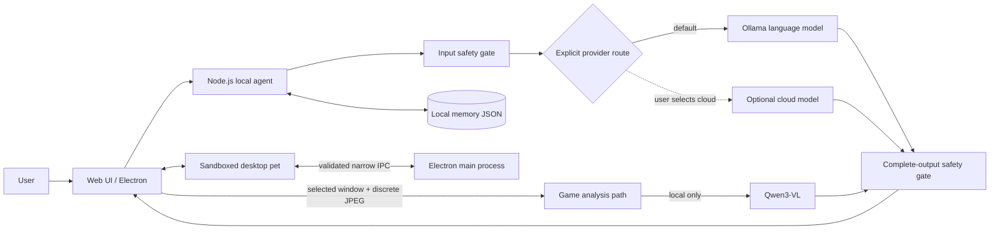

# Amadeus Local Companion

> A privacy-first, local-first multimodal AI companion built with Node.js, Electron, and Ollama.
> 一个强调隐私边界、本地推理与安全工程的多模态 AI 桌面伴侣原型。

<p align="center">
  
</p>

这是一个受《STEINS;GATE》角色牧濑红莉栖启发的非官方工程作品集项目。它不只是给模型套一层聊天界面，而是把本地模型编排、可选云端能力、桌面端安全边界、游戏画面分析、输入/输出安全门和素材合规流程组合成一个可运行的产品原型。

> [!IMPORTANT]
> 本项目用于非商业技术展示，与 MAGES.、NITRO PLUS 或《STEINS;GATE》官方无关。角色名称与形象相关权利归各自权利人所有；若用于商业发布，应替换为原创角色、名称和素材。

## 项目概览

| 维度 | 实现 |
| --- | --- |
| 产品形态 | Web 主界面 + Windows Electron 透明桌宠 |
| AI 路由 | 默认使用本机 Ollama；云端生成只能由用户显式选择 |
| 多模态 | 文字、静态图片、按需语音识别、游戏窗口离散截帧 |
| 本地模型 | Qwen2.5 / Qwen3 / DeepSeek R1 / Qwen3-VL，可在模型中心切换与下载 |
| 隐私设计 | 仅监听本机回环接口；游戏截图禁止远传且不落盘；本地模式不会自动回退云端 |
| 安全设计 | 输入与完整输出双向检查、凭据脱敏、危机支持、严格媒体解析和限流 |
| 桌面安全 | renderer sandbox、context isolation、禁用 Node.js、窄 IPC、来源校验、导航阻断 |
| 工程验证 | 85 个 Node 自动化测试 + 冒烟测试 + Python 语料/素材验证 |

## 为什么值得作为面试作品展示

### 1. 本地优先是代码约束，不是宣传语

- 默认对话走本机 Ollama。
- 本地模型不可用时进入演示状态，不会偷偷把内容发到云端。
- 云端生成和 OpenAI Moderation 分别需要显式配置与开启。
- 游戏画面路径强制 `allowRemote: false`，即使普通聊天启用了远端复核也不会改变。

### 2. 安全检查覆盖模型调用前后

- 用户输入在进入模型前分类、阻断或脱敏。
- 模型完整输出先在内存中缓冲，通过输出检查后才显示。
- 被判定为 `support` 或 `block` 的原文不写入历史。
- 对密码、令牌、手机号、邮箱等内容应用本地检测与脱敏。

这里刻意选择了“安全放行后一次性展示”，而不是先流式输出再补救。代价是牺牲部分首字可见速度，收益是避免不安全内容已经显示后才被拦截。

### 3. Electron 使用最小权限边界

- 主界面和桌宠 renderer 均启用 sandbox 与 context isolation。
- 禁用 renderer 的 Node.js、任意导航、新窗口和通用文件/命令能力。
- preload 只暴露桌宠显示、关闭、返回主界面和边缘状态等窄接口。
- IPC 同时校验 sender、页面来源、参数类型和固定枚举。
- Electron 每次启动独立的本地服务子进程，并使用系统分配的临时端口。

### 4. 游戏陪玩采用可解释的隐私模型

- 用户必须主动选择窗口；默认只在点击后分析一帧。
- 可选 30 / 60 / 120 秒低频观察，画面变化很小时跳过模型调用。
- 截图压缩到最长边 1280px，并受 2MB、300 万像素、单并发与频率限制。
- 画面只交给本地 `qwen3-vl:4b`，不保存到磁盘，也不进入普通对话历史。
- 不读取游戏内存、不控制键鼠、不提供隐藏信息或反作弊绕过。

### 5. 素材与训练数据有明确合规边界

- 仓库不包含原作完整台词、音频、模型权重或本地运行数据。
- 本地人物素材管线要求显式确认处理权利，并记录来源与文件哈希。
- 原始素材、隔离区、授权材料和生成语料默认被 `.gitignore` 排除。
- 静态桌宠素材经过格式、透明通道、尺寸、编号、路径和目录一致性校验。

## 系统架构



## 核心功能

| 模块 | 能力 | 关键实现点 |
| --- | --- | --- |
| 对话 Agent | 文本、图片、语音、多轮历史 | 本地/云端显式路由、停止生成、耗时与状态反馈 |
| 模型中心 | 探测、下载、切换 Ollama 模型 | 流式下载进度、运行状态、语言/视觉模型分离 |
| 长期记忆 | 本地保存偏好、事件和边界 | 保存和调用前均检查；作为非可信用户数据注入 |
| 语音 | faster-whisper tiny + 系统 TTS | 识别进程按需启动并退出；朗读由用户手动开启 |
| 游戏陪玩 | 手动/低频截图分析 | 本地视觉模型、变化检测、无剧透模式、显存释放 |
| 桌面宠物 | 透明置顶、拖动、边缘姿态 | 82 个静态姿态、84 帧动画、目录驱动的按需加载 |
| 安全服务 | 本地策略 + 可选远端复核 | 双向检查、凭据脱敏、危机支持、远端失败时停止 |
| 素材管线 | 语料构建与桌宠资源验证 | 权利确认、来源记录、媒体真格式检查、原子目录同步 |

## 技术栈

- Runtime: Node.js 20+
- Desktop: Electron 43
- Frontend: Vanilla JavaScript, HTML, CSS
- Local AI: Ollama
- Optional cloud: explicit opt-in generation and moderation adapters
- Speech: faster-whisper tiny, Web Speech API
- Tooling: Python 3, PowerShell
- Testing: Node.js test runner, integration smoke tests, Python validation scripts

项目故意没有引入大型前端框架：界面状态、流式事件、媒体采集和桌宠协议都以浏览器原生 API 实现，便于直接审查数据流和安全边界。

## 快速开始

### 环境要求

- Node.js 20+
- Python 3（运行语料和素材验证时需要）
- [Ollama](https://ollama.com/)（使用本地模型时需要）
- Windows 10/11（Electron 桌宠当前主要验证平台）

### 1. 安装

克隆仓库后进入项目目录：

```powershell
npm ci
```

### 2. 准备本地模型

最小文字对话配置：

```powershell
ollama pull qwen2.5:3b
```

如需游戏画面分析：

```powershell
ollama pull qwen3-vl:4b
```

也可以启动应用后在“模型中心”中下载和切换模型。

### 3. 启动 Web 版

```powershell
npm start
```

使用终端显示的本地访问地址打开页面。

### 4. 启动 Electron 桌宠

```powershell
npm run desktop
```

请从自己的 Windows PowerShell 运行。桌面启动脚本会拒绝受限自动化账户，但 Electron 自身仍保留 renderer sandbox、上下文隔离和 IPC 校验。

云端生成与远端安全复核均为显式启用的可选能力。仓库不提供、读取或提交任何真实凭据；游戏截图始终不会发送到远端。

## 验证

快速语法检查与单元测试不要求本地模型：

```powershell
npm run check
```

当前覆盖 85 个 Node 测试，重点验证：

- 安全判定、危机支持、凭据脱敏和远端复核策略
- 图片/音频真实格式、尺寸、动画和路径校验
- 桌宠 catalog、动画 URL、边缘状态与 preload 最小接口
- Electron 启动账户策略

完整集成验收会调用实际本地服务、语言模型、视觉模型和语音模型。先在一个终端运行 `npm start`，再在另一个终端执行：

```powershell
npm test
```

如果只修改素材或人物语料，可分别运行：

```powershell
npm run test:catalog
npm run test:pet
python scripts/test_character_corpus.py
```

## 目录结构

```text
.
├─ electron/                  # 主进程、preload 与窗口边缘状态
├─ lib/                       # 安全分类、安全服务、媒体校验
├─ public/                    # Web UI、桌宠逻辑与可发布素材
├─ data/                      # 原创默认风格词典及本地数据说明
├─ scripts/                   # 启动、冒烟测试、语料与素材管线
├─ tests/                     # Node 自动化测试
├─ server.js                  # 本地 HTTP Agent 与模型编排
└─ docs/                      # 开发交接与许可核查
```

继续开发前请阅读 [`docs/DEVELOPMENT_HANDOFF.md`](docs/DEVELOPMENT_HANDOFF.md)。人物风格素材的使用边界见 [`docs/LEGAL_TEXT_SOURCES.md`](docs/LEGAL_TEXT_SOURCES.md)。

## 隐私与安全不变量

- 服务只绑定回环地址，不对局域网或公网监听。
- 本地模型不可用时不会自动把内容转交云端。
- 游戏截图、游戏上下文和游戏分析永远禁止远程审核。
- 模型输出必须先完整通过安全检查，才会显示给用户。
- Electron renderer 不获得通用文件、shell、URL 或 IPC 权限。
- `.env`、本地记忆、设置、模型、音频、授权原文和隔离区不会进入版本控制。

## 已知限制

- 当前是 Windows 优先的产品原型，尚未制作安装包、代码签名、自动更新和崩溃转储收集。
- Electron 自动化检查已通过，但仍需要更长时间的真实 GUI 稳定性测试。
- 游戏陪玩仍属实验功能，效果受硬件、模型和具体游戏画面影响。
- 本地安全层目前不做图像语义分类；普通聊天图片只有在用户显式开启时才可远程复核。
- 当前朗读使用系统语音，不包含也不宣称使用官方角色音色。

## 项目状态与权利说明

这是个人工程作品集和研究原型，不是官方产品，也不用于替代心理咨询、医疗诊断或紧急服务。

仓库当前未附带开源许可证，因此默认不授予复制、修改或再分发代码与素材的许可。代码作者权利、第三方角色/作品权利和素材使用边界应分别判断；公开可见不等于获得商业使用授权。
